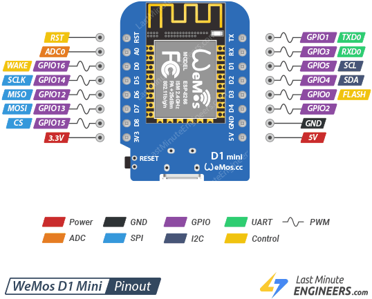

# Goal:

Create a "Sonar Emulator" with the information presented in the form of a "radar" screen.
All coding will be generated using Codex.


# Software:

- [Arduino IDE](https://www.arduino.cc/en/software/)
	- "The Arduino IDE is a free, open-source program for writing code (“sketches”), checking it for errors, and uploading it to an Arduino boards."
	- For this project we need to configure the IDE for an ESP8266.  Instructions can be found here...
	  https://www.youtube.com/watch?v=UUQ84VKg3oM
	
- [Thonny](https://thonny.org/)
	- Thonny is a beginner-friendly app for writing and running Python code.

- [Codex by ChatGPT](https://chatgpt.com/codex/?utm_source=google&utm_medium=paid_search&c_id=23226110534&c_agid=194939268903&c_crid=807810285009&c_kwid=kwd-827611117561&c_ims=&c_pms=9016357&c_nw=g&c_dvc=c&gad_source=1&gad_campaignid=23226110534&gbraid=0AAAAA-I0E5f7W5mTFuf6gr5LX9oKT2n66&gclid=CjwKCAjwkaXUBhASEiwAZI3ds9iR6Z_cTBhbpIHWuGR-XCghlkN1L37nnO0KQ0bv7Ey1-0yHv3DdmBoCnoEQAvD_BwE)
	- OpenAI's AI coding agent built into ChatGPT. It's designed specifically to help with software development (OpenAI)
		- Downloaded and install.
		- You will be prompted to create an account.  I chose the free level.
- [Github](https://github.com/)
	- GitHub is an online platform for storing, sharing, and collaborating on software projects.
		- While technically not needed, using it is considered best practice.
		- You will need to create an account.
# Hardware:
- [WeMos D1 Mini](https://www.amazon.com/dp/B0CL9CTXZH?ref=ppx_yo2ov_dt_b_fed_asin_title&th=1)
- [HC-SR04 Ultrasonic Module Distance Sensor](https://a.co/d/0bF3r0CX)
- [Sg90 9g Micro Servo Motor](https://a.co/d/08NuCzbu) 
- [Solderless breadboard](https://a.co/d/0ajafzjM)
- [Jumper Wires](https://a.co/d/02a42jzD)
  - You will need both (male to male) and (male to female) jumpers.


# 3D Printed Parts:

https://makerworld.com/en/models/3213247-radar-sonar-emulator

**TODO:** The second set of servos I purchased and the wires coming out of the side instead of the bottom.  I modified the servo saddle by adding clearence.  The updated files are in GitHub but not MakerWorld.  *Update MakerWorld*.


# Pinouts:




# Wiring:

| WeMos D1 Mini | HC-SR04 | Servo                |
| ------------- | ------- | -------------------- |
| GND           | GND     | GND (black wire)     |
| 5v            | Vcc     | Power (red wire)     |
| D6 (GPIO12)   | Echo    |                      |
| D7 (GPIO13)   | Trig    |                      |
| D5 (GPIO14)   |         | Signal (yellow wire) |


# My Requests to Codex:

- Create a "Sonar Emulator" using a Wemos D1 Mini, HC-SR04, SG90 servo.
  The output should be a Python script running on my computer that resembles a radar screen.
  Serial communication shall be used between the Wemos D1 Mini and my computer.
  The python script shall identify and use the first usb port with an arduino or clone attached.
  Log all changes in a /Docs folder


- Please make SERVO_PIN = D5, ECHO_PIN = D6, TRIGGER_PIN = D7


- Please make a vertical slider bar in the python script.  Moving it will change the maximum range and redraw the radar screen to suit


# Notes:
> [!NOTE]
>
> I attempted to push my changes up to GitHub and was presented with this error:
>
>  Your remote uses HTTPS, so the simplest route is GitHub CLI authentication:
>  gh auth login
>  Choose:
>
>   1. GitHub.com
>   2. HTTPS
>   3. Login with a web browser
>   4. Confirm Yes when asked to authenticate Git for this account.
>      Finish the browser sign-in, then verify and push:
>       gh auth status
>       git push origin main
>       If gh isn’t installed, install GitHub CLI first (on macOS: brew install gh) or > use a GitHub personal access token when Git prompts for a password—GitHub no longer accepts account passwords for Git over HTTPS. GitHub’s authentication guidance
>
> I did not have GitHub CLI so I opened a terminal and entered:
>
> ```
> brew install gh
> ```
>
> I then typed in the command below And followed the prompts.
>
> ```
> gh auth login
> ```
>


> [!NOTE]
> When trying to flash the WeMos D1 Mini on a Windows 11 PC the following error occurred.
>
> *A serial exception error occurred: Cannot configure port, something went wrong. Original message: PermissionError(13, 'A device attached to the system is not functioning.',*
>
> After much searching the problem seemed to be caused by the newest driver for CH340 USB to Serial chip.  The most prevalent solution was to roll back the driver to the previous version.  ***The problem with this was the "Fix" might have to be re-applied after a Windows Update.***  
>
> Another proposed solution was to change the properties of the driver of the driver to "Enable the Serial Port Enumerator".  See https://www.youtube.com/watch?v=M6oq3dl5gBQ.  ***These simply did not work in our case***.
>
> Brian Witt wrote an article about "Fake CH340 Chips" https://www.digitaltown.co.uk/66FakeCH340Chips.php.  He pointed out the differences between a genuine CH340 chip which had clear markings on top and the "fake" chip which has no markings.  Had D1 minis in both configurations.   The genuine WCH CH340 worked with the latest driver where the fake one did not.  The photo below shows WCH CH340C marking.
>
> 
>
> ***Our solution was to purchase devices with the genuine CH340 chip.***


# Works Cited:

- “Arduino Software.” _Arduino_, [https://www.arduino.cc/en/software](https://www.arduino.cc/en/software). Accessed 22 Aug. 2026.

- “What Is GitHub?” _GitHub Docs_, GitHub, [https://docs.github.com/en/get-started/start-your-journey/what-is-github](https://docs.github.com/en/get-started/start-your-journey/what-is-github). Accessed 22 Aug. 2026.

- *OpenAI*. “Codex.” _OpenAI_, [https://openai.com/codex/](https://openai.com/codex/). Accessed 22 Aug. 2026.
  _Thonny: Python IDE for Beginners._ Thonny, [https://thonny.org/](https://thonny.org/). Accessed 22 Aug. 2026.

- “Installing.” _ESP8266 Arduino Core Documentation_, [https://arduino-esp8266.readthedocs.io/en/latest/installing.html](https://arduino-esp8266.readthedocs.io/en/latest/installing.html). Accessed 22 Aug. 2026.

- Santos, Rui. “Installing ESP8266 Board in Arduino IDE (Windows, Mac OS X, Linux).” *Random Nerd Tutorials*, Random Nerd Tutorials. [https://randomnerdtutorials.com/how-to-install-esp8266-board-arduino-ide/](https://randomnerdtutorials.com/how-to-install-esp8266-board-arduino-ide/?utm_source=chatgpt.com)

- Witt, Brian. “Fake CH340 Chips.” *Digital Town*, https://www.digitaltown.co.uk/66FakeCH340Chips.php. Accessed 26 Aug. 2026.

- Random Nerd Tutorials. “ESP8266 Pinout Reference: Which GPIO Pins Should You Use?” *Random Nerd Tutorials*, https://randomnerdtutorials.com/esp8266-pinout-reference-gpios/. Accessed 26 Aug. 2026.

- Prabhu, Shreepad. "WeMos D1 Mini Pinout Reference." *Last Minute Engineers, https://lastminuteengineers.com/wemos-d1-mini-pinout-reference/.  Accessed 31 Aug. 2026

- Prabhu, Amrit. “How HC-SR04 Ultrasonic Sensor Works & Interface It With Arduino.” *Last Minute Engineers*, 20 Jan. 2026, https://lastminuteengineers.com/arduino-sr04-ultrasonic-sensor-tutorial/. Accessed 31 Aug. 2026.


